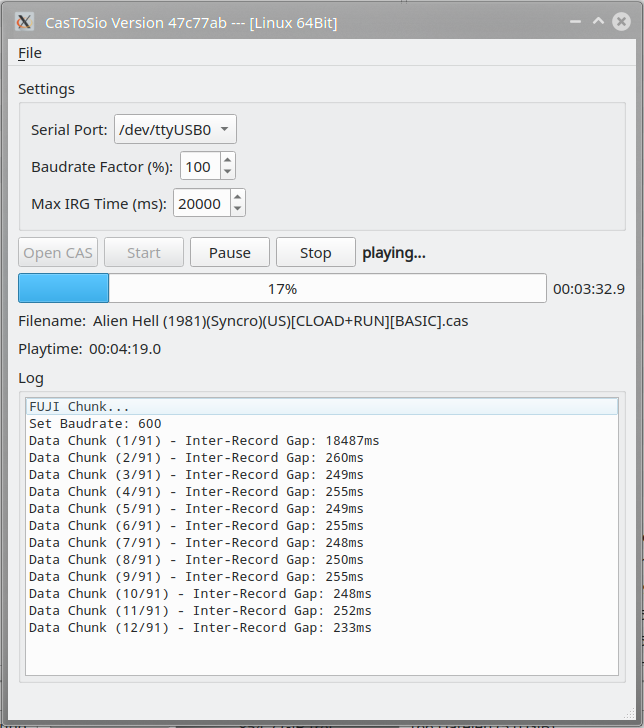
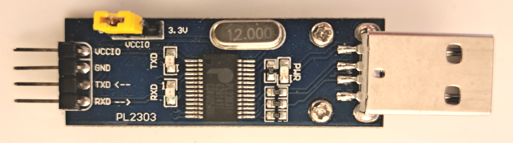
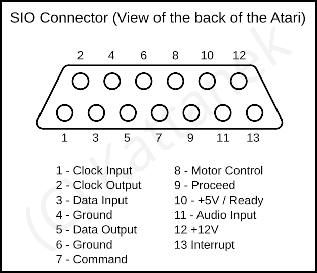

# CasToSio
Transfer cas files to atari 800XL with PL2303TA adapter and this software.

Your must have a usb to uart adapter how this here or similar. The best is with PL2303 chip.

Here is the pinout from the atari sio connector.

Connection
+---+----+
|yyy|cccc|
+---+----+